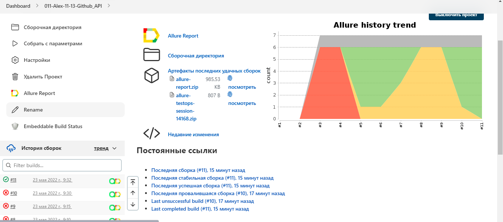

# qa_guru_5_24_final_project
# Автотесты на http://github.com :woman_technologist:


IntelliJ IDEA, Java, Selenide, Selenoid, Gradle, JUnit5, Allure Report, Allure TestOps, Github, Jenkins, Rest-Assured,
Telegram (reports), Jira.

## Реализованы проверки:
В реализации использованы разные подходы проектирования, позволяющие достичь разного представления в отчетах
### UI
- [X] - Авторизация пользователя с неверным паролем
- [X] - Поиск репозитория через поисковую строку
- [X] - Поиск раздела Issue в репозитории
- [X] - Открытие вкладки team
- [X] - Открытие страницы shop
### API
- [X] - Создание репозитория
- [X] - Изменение названия репозитория
- [X] - Удаление репозитория
- [X] - Поиск репозитория до и после создания
- [X] - Создание Issue
- [X] - Редактирование Issue
- [X] - Блокировка Issue

### Команда для запуска из терминала
Локально должны быть заданы параметры в local.properies, app.properties
```
gradle clean
```
Для запуска в несколько потоков
```
gradle clean -Dthreads=5
```
### Видео о прохождении тестов


### Запуск в Jenkins
Статистика по запускам

Указание параметров для запуска


### Отчёт в Allure Report


### Хранение тест-кейсов в Allure TestOps
Ручные и автотесты

Дашборд

Ланчи

Результат запуска ланча


### Интерграция с Jira
Отображение тест-кейсов и ланча


### Уведомления в Telegram
